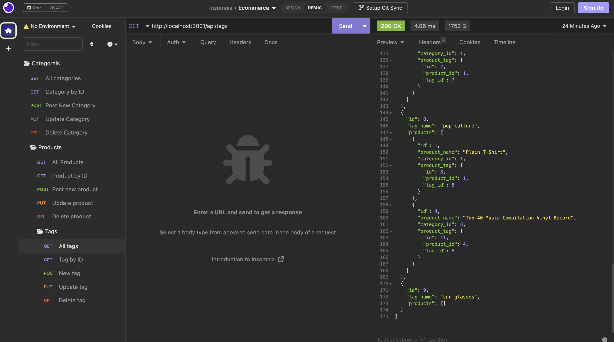

# Object-Relational Mapping (ORM): E-commerce Back End

## Table of Contents

- [Project description](#description)
- [Installation](#installation)
- [Usage](#usage)
- [License](#license)
- [Contribution](#contribution)
- [Tests](#tests)
- [Questions](#questions)

## Description

This project is on mapping relationship in a database for an e-commerce website. The application functions within the followinng three parameters: categories, products, and tags, and forms a relationship between them. The app allows the user to retrieve all, retrieve one, create new, update, and delete: catagories, products, and tags. The application is scalable as the e-commerce grows.

## Usage

It is used by e-commece companies to manage thier database.

## Installation

You will have to install the node modules by doing a npm i and seeds. You will need to run it on Insomnia to view the functionality of the app.

## License

## Contribution

N/A

## Tests

Ran the app several times until I received the desired results.

## Questions

N/A

For additional questions, you can reach me at rsaini88@gmail.com

[Link to Github](https://github.com/rjsaini88)
[Link to video presentation](https://drive.google.com/file/d/1uQEp081p9bETwxDIT5Paj9BPzyfglVWa/view)
